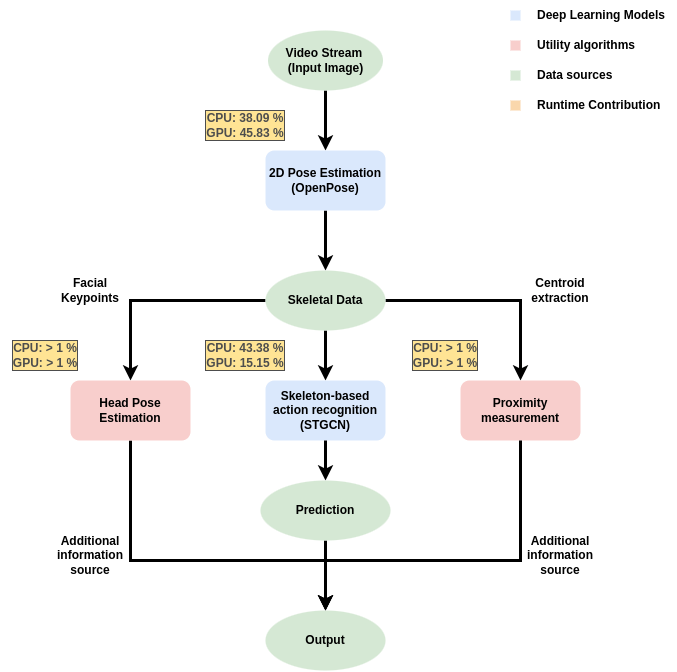

# Master Thesis: Pedestrian detection and tracking for safe robot navigation in urban environments

## **Abstract**
Data-driven methods for tracking people’s poses and predicting their actions based on video streams have been successfully applied in numerous fields, including
surveillance, service robotics, rehabilitation and healthcare physiotherapy, to name a few. However, the literature falls short of methods that attempt to apply these
concepts in the context of autonomous outdoor navigation. More precisely, no one has yet attempted to combine these concepts into an end-to-end solution for
real-time skeleton-based action recognition that supports the decision-making process for the task of autonomous outdoor navigation in urban areas. As such, this
work aims to do just that, using the Lightweight OpenPose architecture for pose estimation and ST-GCN architecture for action classification and testing its realtime capabilities on a NVIDIA Jetson Xavier NX. In addition, the end-to-end solution will be extended with gaze estimation and proximity measurement algorithms to obtain more information about the outside world. This will provide the autonomous robots with a lot of information that will help them in the future with path planning and decision making.

### **About the project**
This project was a joint cooperation between [Capra Robotics ApS](https://capra.ooo/) and the Faculty of the [Technical University of Denmark](https://www.dtu.dk/)  in partial fulfillment of the requirements for the academic degree of Master of Science, studyline [autonomous systems](https://www.dtu.dk/english/education/msc/programmes/autonomous-systems#study-programme__curriculum).

### **Authors**

* [David Anthony Parham](https://github.com/davelbit) (s202385)

### **Acknowledgments**
The provided source course is based on the [OpenDR Project](https://github.com/opendr-eu/opendr), however it only contains the necessary code for the end-end-solution.

### **Prerequisites**
It's necessary to follow the [installation guidelines](https://github.com/opendr-eu/opendr/blob/master/docs/reference/installation.md) of the OpenDR project, to work properly.

### **End-to-end solution**
The proposed solution consists of two deep neural network models (OpenPose (lightweight) and ST-GCN) and two additional algorithms for head pose estimation and proximity measurement.
As illustrated in the figure below.




### **Methods explained**
In the following short explanations are given, about the workings of the indidvidual components of the end-to-end solution. Please refer to file [thesis.pdf]() for a full explanation.

#### **Human Pose Estimation**
The human posture estimation model uses a CNN as a feature extractor and then computes headmaps of the body joints and their partial affinity fields to find out which keypoints belong to the same skeleton. Then, a greedy algorithm is used to assign all keypoints to the "correct" skeletet.

#### **Action Recognition**
The model takes skeletal data, provided by the OpenPose model, as input and tries to find a spatial and temporal correlation between the keypoints (body joint) when actions are performed.

#### **Head Pose Estimation**
When estimating the head pose, a certain number of keypoints are used as reference points (in this case 5) in 2D and 3D space. Using these values, with some linear algebra it becomes possible to determine the necessary rotation and translation vectors to create an approximation of the 2D points in 3D space.

#### **Proximity measurement**
The Euclidean distance between each pair of pedestrians in the image is calculated based on the centroids of their skeletons estimated by using simple trigonometry among the following three key points (neck, left hip, and right hip).


#### **Demonstration**

Full scale demonstration         |  Simple demonstration
:-------------------------:|:-------------------------:
  |  

#### **Action recognition output**
Since action detection should be performed for each person in the frame, it was decided to output the actions of the corresponding persons in the console. It was also to prevent the visual output (as shown in the demonstration videos above) from becoming too cluttered if more text filled the frame.

> Note: The robot does not require visual feedback once it is deployed. The videos are only there to facilitate understanding.


### **Installation**

Please refer to the official [installation](https://github.com/opendr-eu/opendr/blob/master/docs/reference/installation.md) guidelines of the OpenDr project.

Afterwards run the following command line command to ensure that all needed dependencies are installed.

To install the required libraries, run:
```bash
$ pip install -r requirements.txt
```

### **Project structure**

#### **OpenPose**
- [/OpenPose/](https://github.com/davelbit/Capra-Thesis/tree/main/OpenPose)
  - Folder that contains all the important files for the OpenPose implementation.
- [/OpenPose/openpose_default/](https://github.com/davelbit/Capra-Thesis/tree/main/OpenPose/openpose_default)
    - Contains the pretrained model files.
- [/OpenPose/temp/](https://github.com/davelbit/Capra-Thesis/tree/main/OpenPose/temp)
    - Contains the onnx optimized model file.
- [/OpenPose/utils.py](https://github.com/davelbit/Capra-Thesis/tree/main/OpenPose/utils.py)
    - Utility file that contains most custom function that extend the default OpenDR implementation, such as, head pose estimation and proximity measurement estimation.
- [/OpenPose/demo.py](https://github.com/davelbit/Capra-Thesis/tree/main/OpenPose/demo.py)
    - OpenPose run file (with head pose estimation and proximity measurement estimation).

#### **ST-GCN**
- [/ST-GCN/](https://github.com/davelbit/Capra-Thesis/tree/main/ST-GCN)
  - Folder that contains all the important files for the end-to-end solution.
- [/ST-GCN/data/](https://github.com/davelbit/Capra-Thesis/tree/main/ST-GCN/data)
  - Training and validation files for the ST-GCN model
- [/ST-GCN/openpose_default/](https://github.com/davelbit/Capra-Thesis/tree/main/OpenPose/openpose_default)
  - Contains the pretrained model files for lightweight OpenPose.
- [/ST-GCN/pretrained_models/](https://github.com/davelbit/Capra-Thesis/tree/main/ST-GCN/pretrained_models)
    - Contains the pretrained model files for ST-GCN.
- [/ST-GCN/temp/](https://github.com/davelbit/Capra-Thesis/tree/main/ST-GCN/temp)
    - Contains the onnx optimized model file.
- [/ST-GCN/utils.py](https://github.com/davelbit/Capra-Thesis/tree/main/ST-GCN/utils.py)
    - Utility file that contains most custom function that extend the default OpenDR implementation, such as, head pose estimation and proximity measurement estimation.
- [/ST-GCN/run.py](https://github.com/davelbit/Capra-Thesis/tree/main/ST-GCN/run.py)
    - Run file of the entire end-to-end solution
- [/ST-GCN/train.py](https://github.com/davelbit/Capra-Thesis/tree/main/ST-GCN/train.py)
    - Training script for the ST-GCN model
- [/ST-GCN/skeleton_extraction_custom.py](https://github.com/davelbit/Capra-Thesis/tree/main/ST-GCN/skeleton_extraction_custom.py)
    - Script, that extracts the skeleton data from video files, to form the training and validation sets.
